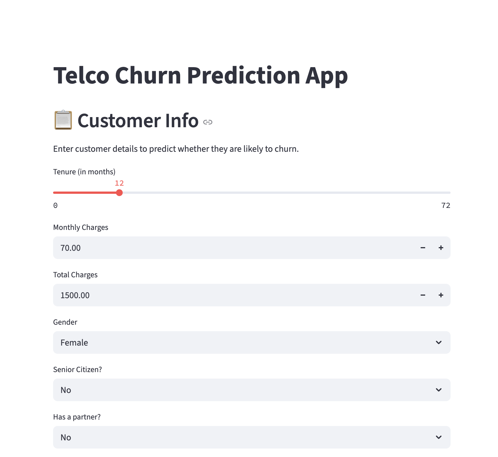
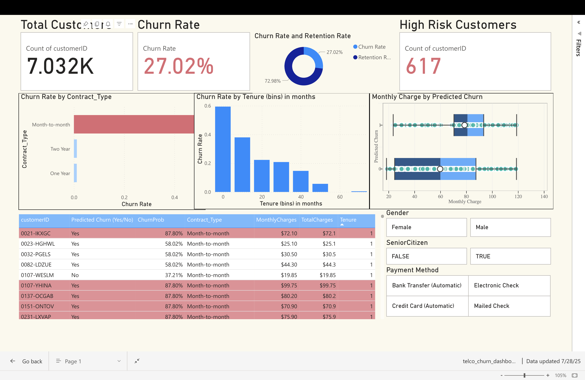

# Telco Customer Churn Prediction App

This Streamlit app predicts whether a telecom customer is likely to **churn** based on their account information, contract type, and service usage. It's powered by a decision tree machine learning model trained on real-world telco customer data.



---

## 📊 How It Works

- Built with a **Decision Tree Classifier**
- Takes in 30 customer features like:
  - Monthly charges
  - Tenure
  - Internet service type
  - Payment method
  - Streaming activity
  - Contract type
- Outputs a prediction of:
  - `✅ Likely to Stay`
  - `⚠️ Likely to Churn`
- Also displays the **probability** of churn for greater interpretability

---

## 🚀 Try It Live

🔗 [Launch the app on Streamlit Cloud](https://churn-prediction-app-fe7yidjcssfqxpttfksov9.streamlit.app/)

> You can also clone this repo and run locally using Streamlit.

---

## 📊 Power BI Dashboard

This dashboard visualizes customer churn trends across various dimensions like contract type, payment method, and tenure.



You can also view a pdf version of the dashboard or the powerbi version below:
[PDF Version](telco_churn_dashboard.pdf)
[PowerBI Version](telco_churn_dashboard.pbix)

---

## 🧠 ML Model Details

- **Model**: Decision Tree Classifier (`scikit-learn`)
- **Training set**: Telco Customer Churn dataset
- **Feature Engineering**:
  - One-hot encoding for categorical variables
  - Scaling not required for tree-based model
- **Evaluation Metrics**:
  - Accuracy: ~78%
  - F1-score (churn class): ~0.58
  - Balanced precision/recall performance

---

## 🛠️ Tech Stack

- **Python** – Data preprocessing, model training (Decision Tree)
- **scikit-learn** – Machine learning modeling and evaluation
- **Streamlit** – Web app development and deployment
- **joblib** – Model persistence
- **Power BI** – Data visualization and dashboard creation


---

## 📦 Installation (Run Locally)

```bash
git clone https://github.com/Ishitajain1001/churn-prediction-app.git
cd churn-prediction-app
pip install -r requirements.txt
streamlit run app.py
